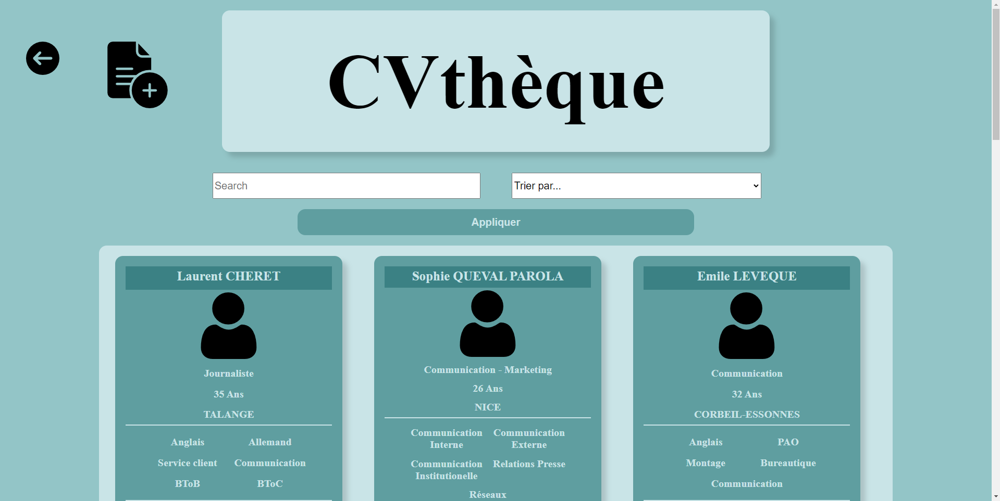

# Application de Gestion de Personnel (CVthèque)

L'**Application de Gestion de Personnel** est une solution complète développée en PHP pour gérer efficacement les informations et les CV des employés dans un service de ressources humaines. Cette CVthèque permet de stocker et de gérer les données importantes des employés, telles que les informations personnelles, les compétences, les coordonnées, les CV en PDF, et les liens vers les réseaux sociaux.

## Fonctionnalités

- **Gestion des Données Employé** : Stockage des informations clés sur les employés, y compris le nom, le prénom, le métier, l'âge, la ville, les compétences, l'adresse, le numéro de téléphone, l'adresse e-mail, le CV en PDF et les liens vers les réseaux sociaux.

- **Affichage des Données** : Consultation facile des informations des employés sous forme de liste, permettant une vue d'ensemble rapide de la CVthèque.

- **Modification et Suppression** : Possibilité de modifier les informations des employés existants et de les supprimer si nécessaire.

- **Ajout d'Employés** : Formulaire de saisie pour ajouter de nouveaux employés à la CVthèque, avec toutes les informations pertinentes.

## Capture d'écran

## Configuration requise

- Un serveur web avec prise en charge de PHP (par exemple, Apache).
- Un navigateur web moderne compatible avec HTML et CSS.

## Utilisation

1. Consultez la liste des employés existants avec leurs informations de base.

2. Pour modifier les détails d'un employé, cliquez sur le bouton de modification et apportez les modifications nécessaires.

3. Pour supprimer un employé de la CVthèque, cliquez sur le bouton de suppression correspondant.

4. Pour ajouter un nouvel employé, remplissez le formulaire d'ajout avec les informations requises.

## Crédits

- Ce projet a été développé en PHP.
- Les icônes ont été obtenues auprès de [FontAwesome](https://fontawesome.com/).

## Auteur

Lenoir Yohan
